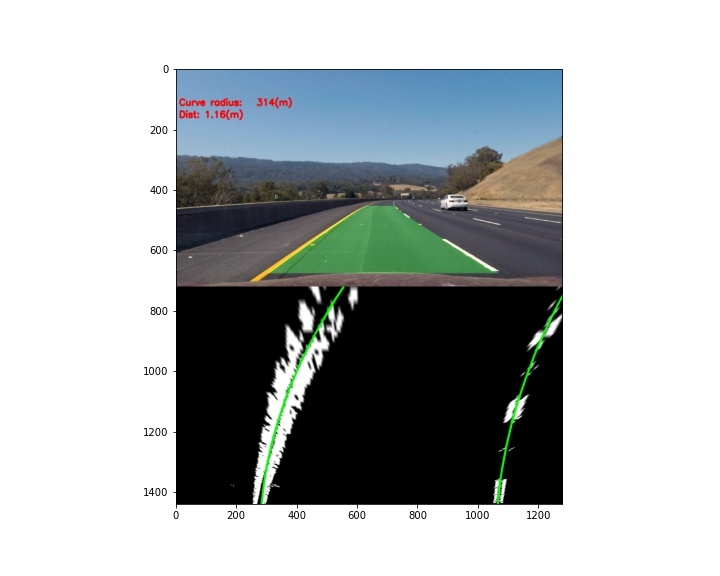

**Advanced Lane Finding Project**

The goals / steps of this project are the following:

* Compute the camera calibration matrix and distortion coefficients given a set of chessboard images.
* Apply a distortion correction to raw images.
* Use color transforms, gradients, etc., to create a thresholded binary image.
* Apply a perspective transform to rectify binary image ("birds-eye view").
* Detect lane pixels and fit to find the lane boundary.
* Determine the curvature of the lane and vehicle position with respect to center.
* Warp the detected lane boundaries back onto the original image.
* Output visual display of the lane boundaries and numerical estimation of lane curvature and vehicle position.

## [Rubric](https://review.udacity.com/#!/rubrics/571/view) Points

All project source code is located in "lane finding.ipynb"

### Camera Calibration

#### 1. Briefly state how you computed the camera matrix and distortion coefficients. Provide an example of a distortion corrected calibration image.

The code for this step is contained in the "Camera calibration" section of the notebook.
Approach I used is not different from what was suggested in lectures.
Here's an example of an undistorted chessboard:

### Pipeline (single images)

#### 1. Provide an example of a distortion-corrected image.

#### 2. Describe how (and identify where in your code) you used color transforms, gradients or other methods to create a thresholded binary image.  Provide an example of a binary image result.

I used a combination of what is described in lectures. I tried quite a lot of combinations, ended up with an approach that uses sober gradients on the gray image and saturaion channel. Exact code is located in section "Lanes pipeline" in the notebooks. Each operation on image is coded as a separate entity, so I could compose them easily. This approach also helped me to visualize all intermediate steps in the pipeline automatically, so I could identify at which step it fails.

Below are the results (including the intermediate ones) of the whole pipeline for test images.

#### 3. Describe how (and identify where in your code) you performed a perspective transform and provide an example of a transformed image.

Again, straight according to the lectures. I marked a trapeze (in red on the image below) and used its points as source points. Destination points form a rectangular (in green). The code is in "Perspective transform" section of the notebook.

#### 4. Describe how (and identify where in your code) you identified lane-line pixels and fit their positions with a polynomial?

Code for this part is located in "Identify lanes" sections. Here I decided to try my own approach.
Firstly, I split the image into two parts -- one for the left lane, another is for the right lane. For each part I do the following:
I select all active pixels from the bottom half (y >= y_base) and try to fit a polynomial with high regularization parameter, so it tends to be a straight vertical line. Then on each iteration I fit a parabola again (with low regularization), but only on active pixels that are within a margin to a previous curve. I also decrease y_base on each iteration, so that it becomes zero in the last iteration.
I also used a solver from scikit learn that is supposed to be more robust with outliers.

#### 5. Describe how (and identify where in your code) you calculated the radius of curvature of the lane and the position of the vehicle with respect to center.

I used some student's trick (from lectures) in order to transform parabola coefficients from pixels to meters. I used warped image to identify scaling factors (YM_PER_PIX and XM_PER_PIX in the notebook) assuming that distance between lanes and the length of the lane are known.

In order to calculate the position of the vehicle with respect to center, I did all calculations along the bottom border (y == 720) of the warped image. I found x coordinate of each lane by calculating parabola value at y == 720. Assuming that car center has x == width / 2, it's trivial to find the distance between the middle of the lanes and the center of the car. Then I used XM_PER_PIX in order to go from pixels to meters.

#### 6. Provide an example image of your result plotted back down onto the road such that the lane area is identified clearly.

I used code from lectures (in `udacity_helper` function in the notebook).

---

### Pipeline (video)

#### 1. Provide a link to your final video output.  Your pipeline should perform reasonably well on the entire project video (wobbly lines are ok but no catastrophic failures that would cause the car to drive off the road!).

Here's a [link to my video result](./test_videos_output/project_video.mp4)

---

### Discussion

#### 1. Briefly discuss any problems / issues you faced in your implementation of this project.  Where will your pipeline likely fail?  What could you do to make it more robust?

The problem with current approach is that car bounces sometimes, that makes perspective transform incorrect.
